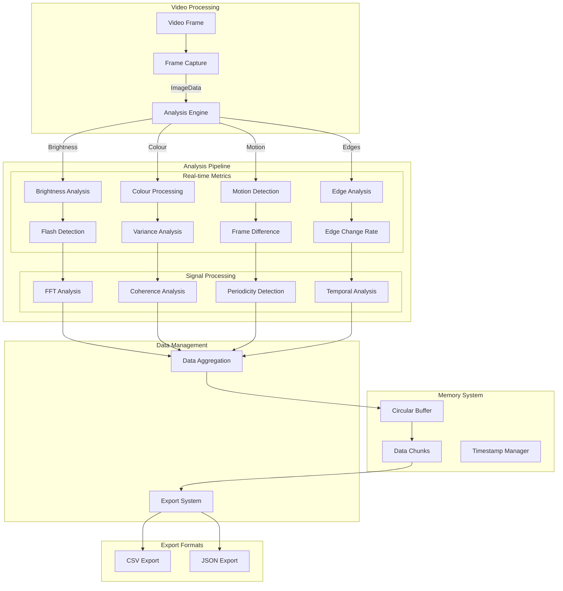
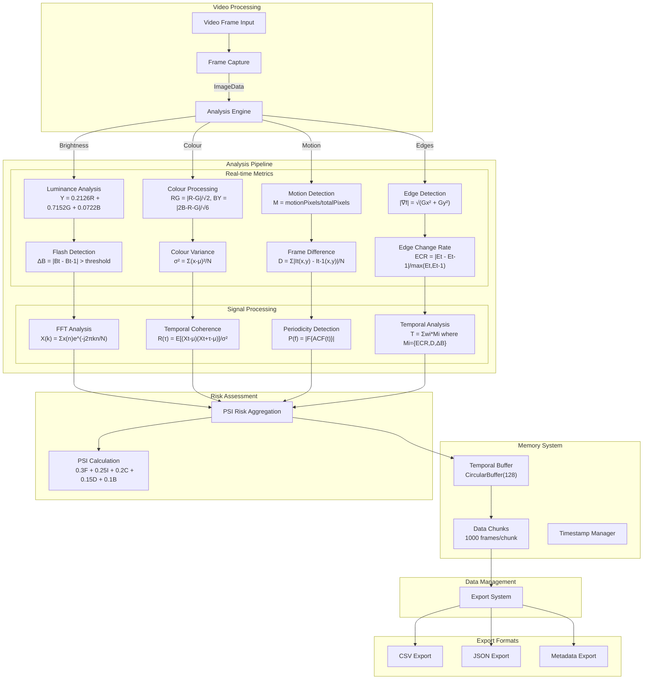

# EPI-LENS
**E**pilepsy **P**hotic **I**ntensity **L**evel **E**valuator for **N**euro Visual **S**timuli

EPI-LENS is a browser extension designed to analyse video content for potentially harmful photosensitive triggers in real-time. It provides detailed metrics and analytics for researchers and accessibility specialists and exports as CSV and JSON.

## Use Cases

### Machine Learning Data Collection
- Generation of training datasets for ML models focused on:
  - Flash detection algorithms
  - Content safety classification
  - Automated video content moderation
- Structured data export in CSV/JSON formats for direct ML pipeline integration
- Frame-by-frame analysis with detailed metrics for model training
- Temporal analysis data for sequence-based learning models

### Accessibility Research
- Quantitative analysis of video content for accessibility studies
- Documentation of potentially harmful content patterns
- Development of improved safety guidelines
- Validation of content modification techniques
- Support for academic research in photosensitive epilepsy triggers
- Identification of problematic sequences
- Guidance for content modifications
- Quality assurance for accessibility compliance

## Core Metrics Implementation

### 1. Brightness Analysis
- **Method**: Relative luminance calculation
- **Formula**: `Y = 0.2126R + 0.7152G + 0.0722B`
- **Sampling**: Reduced resolution (1/4) for performance
- **Frame Buffer**: 128-frame circular buffer

### 2. Flash Detection
- **Primary Method**: Frame-to-frame brightness difference
- **Threshold**: Configurable, default 0.1
- **Validation**: Temporal coherence check
- **Memory**: Maintains last 30 frames

### 3. Spectral Analysis
- **Method**: Fast Fourier Transform (FFT)
- **Window Size**: 64 samples
- **Frequency Range**: 0-30Hz
- **DC Component**: Filtered out
- **Resolution**: ~0.94Hz (60fps/64)

### 4. Edge Detection
- **Algorithm**: Sobel operator
- **Magnitude**: `|∇f| = √(Gx² + Gy²)`
- **Thresholding**: Dynamic based on frame statistics
- **Temporal**: Edge change rate tracking

### 5. Motion Analysis
- **Method**: Frame difference
- **Metric**: `motionRatio = motionPixels/totalPixels`
- **Threshold**: 0.1 * 765 (RGB max)
- **History**: Rolling average of 10 frames

### 6. Colour Processing
- **Variance**: Per-channel statistical analysis
- **Chromatic Flash**: Red-Green and Blue-Yellow contrast
- **History**: 30-frame colour buffer
- **Spike Detection**: 2σ threshold

### 7. Temporal Coherence
- **Method**: Autocorrelation analysis
- **Window**: 30 frames
- **Formula**: `R(τ) = E[(Xt - μ)(Xt+τ - μ)]/σ²`
- **Periodicity**: Peak detection in ACF

### 8. PSI Calculation
Components and weights:
- Frequency (F): 30% - Flash rate normalized to 3Hz
- Intensity (I): 25% - Brightness difference
- Coverage (C): 20% - Spatial distribution
- Duration (D): 15% - Temporal persistence
- Brightness (B): 10% - Absolute luminance

## Memory Management

### Data Chunking
- Chunk size: 1000 frames
- Buffer type: Circular for recent data
- Export: Full dataset reconstruction
- Cleanup: Automatic garbage collection

### Timeline Data
- Real-time buffer: 300 frames
- Export buffer: All chunks + current
- Timestamp tracking: Relative and absolute
- Memory optimization: Sparse storage

### Performance Optimization
- Frame rate limiting: 60fps
- Resolution reduction: 1/4
- Data compression: JSON/CSV optimization
- Memory footprint: ~10MB per 1000 frames

## Architecture Overview

## Technical Architecture

### Graphs from test run on music performance video 

