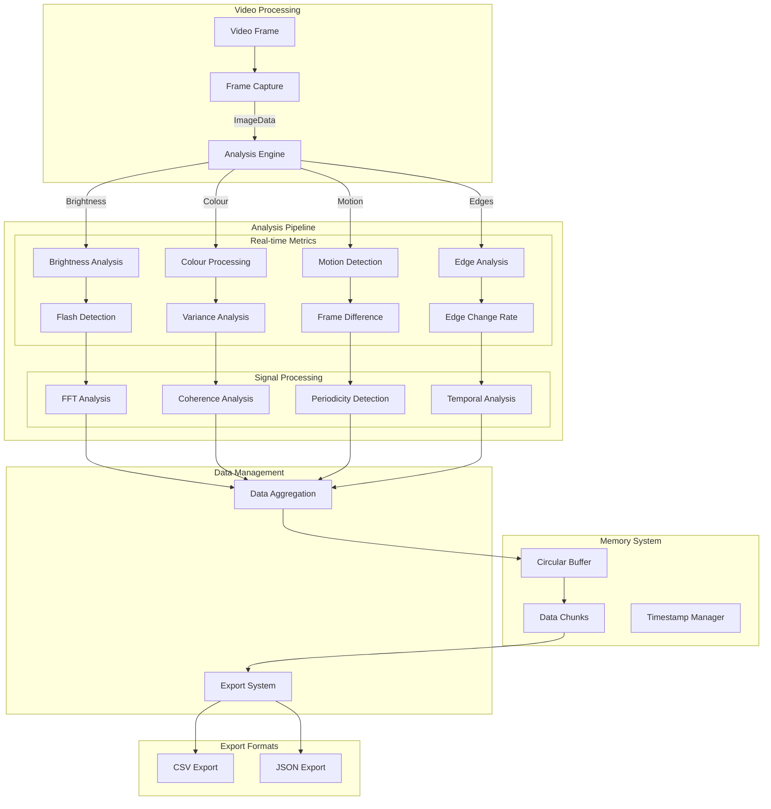
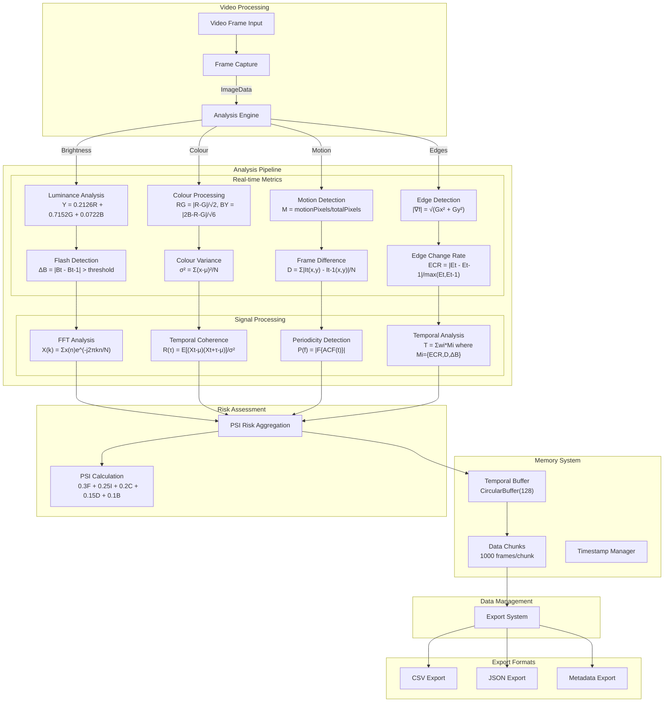

# EPI-LENS
**E**pilepsy **P**hotic **I**ntensity **L**evel **E**valuator for **N**euro Visual **S**timuli

EPI-LENS is a browser extension designed to analyse video content for potentially harmful photosensitive triggers in real-time. It provides detailed metrics and analytics for researchers and accessibility specialists and exports as CSV and JSON.

## Use Cases

### Machine Learning Data Collection
- Generation of training datasets for ML models focused on:
  - Flash detection algorithms
  - Content safety classification
  - Automated video content moderation
- Structured data export in CSV/JSON formats for direct ML pipeline integration
- Frame-by-frame analysis with detailed metrics for model training
- Temporal analysis data for sequence-based learning models

### Accessibility Research
- Quantitative analysis of video content for accessibility studies
- Documentation of potentially harmful content patterns
- Development of improved safety guidelines
- Validation of content modification techniques
- Support for academic research in photosensitive epilepsy triggers
- Identification of problematic sequences
- Guidance for content modifications
- Quality assurance for accessibility compliance

## Core Metrics Overview

| Metric | Formula/Method | Purpose | Output Range | Use Case |
|--------|---------------|---------|--------------|-----------|
| Relative Luminance | Y = 0.2126R + 0.7152G + 0.0722B | Base brightness calculation | 0.0 - 1.0 | Flash detection baseline |
| Flash Detection | ΔB = \|Bt - Bt-1\| > threshold | Identify sudden brightness changes | Binary (0/1) | Trigger identification |
| Colour Contrast | RG = \|R-G\|/√2, BY = \|2B-R-G\|/√6 | Measure chromatic changes | 0.0 - 1.0 | Colour-based trigger analysis |
| Motion Ratio | M = motionPixels/totalPixels | Quantify frame-to-frame motion | 0.0 - 1.0 | Movement pattern analysis |
| Edge Change Rate | ECR = \|Et - Et-1\|/max(Et,Et-1) | Track spatial pattern changes | 0.0 - 1.0 | Pattern transition detection |
| Temporal Coherence | R(τ) = E[(Xt-μ)(Xt+τ-μ)]/σ² | Measure pattern regularity | -1.0 - 1.0 | Pattern periodicity analysis |
| Spectral Analysis | X(k) = Σx(n)e^(-j2πkn/N) | Frequency domain analysis | 0 - 30Hz | Flicker frequency detection |
| Frame Entropy | -Σp(x)log₂p(x) | Measure frame complexity | 0.0 - 8.0 | Content complexity analysis |
| Colour Variance | σ² = Σ(x-μ)²/N per channel | Track colour stability | 0.0 - 1.0 | Colour change detection |
| Spatial Distribution | Center vs Periphery ratio | Analyze flash location | 0.0 - 1.0 | Location-based risk assessment |
| Frame Difference | D = Σ\|It(x,y) - It-1(x,y)\|/N | Measure frame changes | 0.0 - 1.0 | Motion intensity analysis |
| Edge Density | ED = edgePixels/totalPixels | Measure edge content | 0.0 - 1.0 | Pattern complexity analysis |
| Temporal Change Rate | TCR = \|Ct - Ct-1\|/Δt | Track change speed | 0.0 - 1.0 | Temporal pattern analysis |
| Chromatic Flash | CF = max(RG, BY) > threshold | Detect colour flashes | Binary (0/1) | Colour safety assessment |
| Flicker Frequency | f = sampleRate * k/N | Measure flash rate | 0 - 60Hz | Frequency-based risk analysis |
| PSI Score | 0.3F + 0.25I + 0.2C + 0.15D + 0.1B | Overall risk assessment | 0.0 - 1.0 | Content safety evaluation |
| Periodicity Detection | P(f) = \|F{ACF(t)}\| | Identify patterns | 0.0 - 1.0 | Pattern repetition analysis |
| Coverage | C = brightPixels/totalPixels | Measure affected area | 0.0 - 1.0 | Spatial impact assessment |
| Duration | D = flashSequence/totalFrames | Measure persistence | 0.0 - 1.0 | Temporal impact assessment |
| Red-Green Contrast | RG = \|R-G\|/√2 | Measure RG opposition | 0.0 - 1.0 | Colour contrast safety |
| Blue-Yellow Contrast | BY = \|2B-R-G\|/√6 | Measure BY opposition | 0.0 - 1.0 | Colour contrast safety |
| Temporal Edge Change | TEC = \|Et - Et-1\| | Track edge stability | 0.0 - 1.0 | Pattern stability analysis |
| Motion Density | MD = movingPixels/frameArea | Quantify motion | 0.0 - 1.0 | Motion impact assessment |

## Core Metrics Implementation

## Core Metrics Implementation

### 1. Luminance Analysis
- Uses HTML5 Canvas API to capture frames directly from YouTube video player
- Downsamples video to 1/4 resolution for real-time performance
- Processes frames through circular buffer for comparison
- Applies ITU-R BT.709 coefficients directly to RGB channels
- Updates at 60fps with frame skipping when necessary

### 2. Flash Detection
- Compares consecutive frames in circular buffer
- Maintains 30-frame history for pattern detection
- Uses dual-threshold system:
  - Primary threshold for immediate changes
  - Secondary threshold for pattern validation
- Updates risk assessment based on flash frequency

### 3. Colour Analysis
- Processes RGB channels independently
- Maintains separate buffers for each colour channel
- Calculates opponent colour values in real-time
- Tracks chromatic changes through 30-frame history
- Applies statistical variance calculations per channel

### 4. Motion Analysis
- Performs pixel-by-pixel comparison between frames
- Uses reduced resolution grid for performance
- Calculates motion vectors in 8x8 pixel blocks
- Tracks motion density through 10-frame window
- Updates motion metrics every frame

### 5. Edge Detection
- Implements Sobel operator for real-time edge detection
- Processes horizontal and vertical gradients separately
- Uses dynamic thresholding based on frame content
- Maintains edge history for pattern detection
- Updates edge metrics every frame

### 6. Temporal Analysis
- Maintains rolling buffer of 128 frames
- Processes frame sequences for pattern detection
- Calculates coherence scores in real-time
- Updates temporal metrics every frame
- Uses sparse storage for efficiency

### 7. Spectral Processing
- Implements custom FFT for real-time analysis
- Uses 64-sample windows with overlap
- Processes frequency components up to 30Hz
- Filters DC component automatically
- Updates spectral data every 64 frames

### 8. PSI Score Calculation
- Combines multiple metrics in real-time:
  - Flash frequency from temporal analysis
  - Intensity from luminance analysis
  - Coverage from spatial analysis
  - Duration from pattern detection
- Updates score continuously with new data
- Adjusts weights dynamically based on content

### 9. Data Management
- Uses circular buffers for all metrics
- Implements chunked storage for long videos
- Manages memory through automatic cleanup
- Maintains separate buffers for different metrics
- Synchronizes all metric updates

### 10. Export System
- Processes metrics into CSV/JSON formats
- Includes timestamps for all measurements
- Maintains data integrity across chunks
- Provides complete metric history
- Handles large datasets efficiently

### 11. Performance Optimization
- Implements frame skipping when necessary
- Uses reduced resolution processing
- Maintains separate update rates per metric
- Optimizes memory usage through sparse storage
- Balances accuracy with performance

## Memory Management

### Data Chunking
- Chunk size: 1000 frames
- Buffer type: Circular for recent data
- Export: Full dataset reconstruction
- Cleanup: Automatic garbage collection

### Timeline Data
- Real-time buffer: 300 frames
- Export buffer: All chunks + current
- Timestamp tracking: Relative and absolute
- Memory optimization: Sparse storage

### Performance Optimization
- Frame rate limiting: 60fps
- Resolution reduction: 1/4
- Data compression: JSON/CSV optimization
- Memory footprint: ~10MB per 1000 frames

## Architecture Overview

## Technical Architecture

### Graphs from test run on music performance video, using only a select number of metrics

