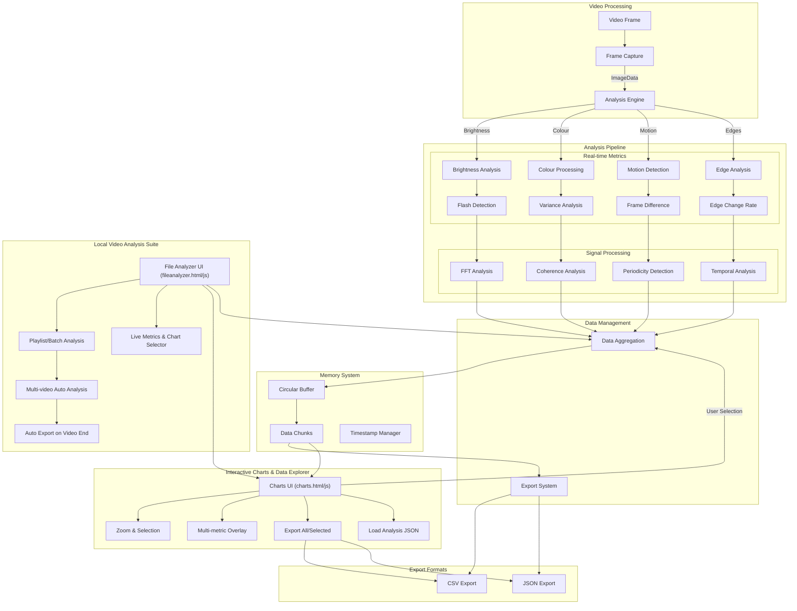
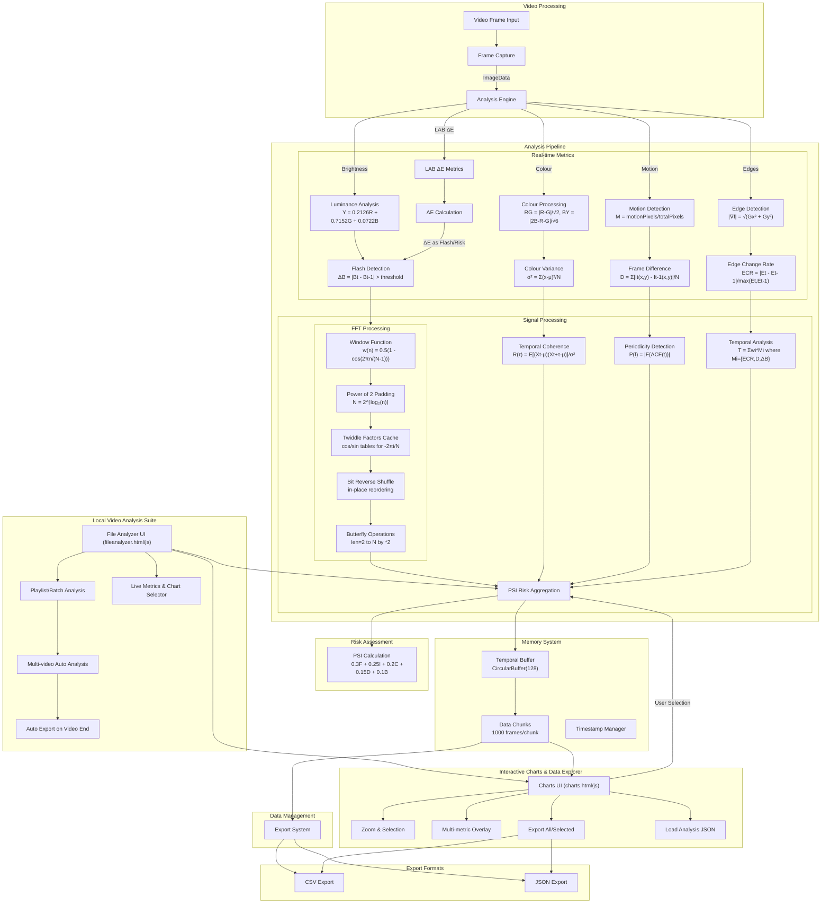

# EPI-LENS

**E**pilepsy **P**hoto-**I**ntensity **L**ens

EPI-LENS is a browser extension designed to analyse video content for potentially harmful photosensitive triggers in real-time. Designed for use in empirical research, accessibility auditing and machine learning dataset generation. 

Extracts temporal, spatial and spectral metrics from video content and exports data as CSV and JSON.

Think of it like PEAT (Photosensitive Epilepsy Analysis Tool) but open source, vanilla JS and a browser extension.

## Now supports YouTube video and offline/local playlist live analysis. 

 

Graphs above shows a small selection of metrics for ease of understanding, the first from a Python notebook and the second from the new intergated chart dashboard.

### Updated Local/offline video analysis suite.
Risk score is calculated as instances of a flash for threshold criteria within set durations.

## Use Cases

### Machine Learning Data Collection
- Generation of training datasets for ML models focused on:
  - Flash detection algorithms
  - Content safety classification
  - Automated video content moderation
- Structured data export in CSV/JSON formats for direct ML pipeline integration
- Frame-by-frame analysis with detailed metrics for model training
- Temporal analysis data for sequence-based learning models

### Accessibility Research
- Quantitative analysis of video content for accessibility studies
- Documentation of potentially harmful content patterns
- Development of improved safety guidelines
- Validation of content modification techniques
- Support for academic research in photosensitive epilepsy triggers
- Identification of problematic sequences
- Guidance for content modifications
- Quality assurance for accessibility compliance

# Compatibility
- YouTube
- Local files via local video analysis suite

## Recent updates
- Progress bar for video being analysed in UI
- UI buttons for start analysis and stop analysis, play and pause the video respectively.
- Improve current O(N²) FTT by using Cooley-Turkey reducing time complexity to O(m log m)
- More efficient FFT using the Cooley-Tukey algorithm with radix-2 decomposition with typed arrays
- Integrated chart dashboard
- Mermaid diagram updated with LAB updates in testing
-  Load JSON feature, to get around 5mb data limit in local storage.
-  Offline video analysis suite with built in playlist analysis, at video end it exports the data as CSV and JSON then starts analysis of next video.
-  Further updates to analysis suite with clearer and more helpful formatting and stats report.
-  Red intensity and red delta metrics for improved detection of color based flashes and rapid red channel changes.

## Updates in progress
- LAB metrics:
    - CIE76 ΔE
    - RGB to LAB conversion
    - ΔE calculation
-  Typed array buffering
-  Multi-timescale flicker detection
-  Flash pattern detection improvements
  

## Future metrics
- Chromatic Flicker Fusion Rate (CFFR)
- Spatiotemporal Contrast Sensitivity Metric (STCSM)
- Temporal Clustering of Flashes

## Core Metrics Overview

| Metric | Formula/Method | Purpose | Output Range | Use Case |
|--------|---------------|---------|--------------|-----------|
| Relative Luminance | Y = 0.2126R + 0.7152G + 0.0722B | Base brightness calculation | 0.0 - 1.0 | Flash detection baseline |
| Flash Detection | ΔB = \|Bt - Bt-1\| > threshold | Identify sudden brightness changes | Binary (0/1) | Trigger identification |
| Colour Contrast | RG = \|R-G\|/√2, BY = \|2B-R-G\|/√6 | Measure chromatic changes | 0.0 - 1.0 | Colour-based trigger analysis |
| Motion Ratio | M = motionPixels/totalPixels | Quantify frame-to-frame motion | 0.0 - 1.0 | Movement pattern analysis |
| Edge Change Rate | ECR = \|Et - Et-1\|/max(Et,Et-1) | Track spatial pattern changes | 0.0 - 1.0 | Pattern transition detection |
| Temporal Coherence | R(τ) = E[(Xt-μ)(Xt+τ-μ)]/σ² | Measure pattern regularity | -1.0 - 1.0 | Pattern periodicity analysis |
| Spectral Analysis | X(k) = Σx(n)e^(-j2πkn/N) | Frequency domain analysis | 0 - 30Hz | Flicker frequency detection |
| Frame Entropy | -Σp(x)log₂p(x) | Measure frame complexity | 0.0 - 8.0 | Content complexity analysis |
| Colour Variance | σ² = Σ(x-μ)²/N per channel | Track colour stability | 0.0 - 1.0 | Colour change detection |
| Spatial Distribution | Center vs Periphery ratio | Analyze flash location | 0.0 - 1.0 | Location-based risk assessment |
| Frame Difference | D = Σ\|It(x,y) - It-1(x,y)\|/N | Measure frame changes | 0.0 - 1.0 | Motion intensity analysis |
| Edge Density | ED = edgePixels/totalPixels | Measure edge content | 0.0 - 1.0 | Pattern complexity analysis |
| Temporal Change Rate | TCR = \|Ct - Ct-1\|/Δt | Track change speed | 0.0 - 1.0 | Temporal pattern analysis |
| Chromatic Flash | CF = max(RG, BY) > threshold | Detect colour flashes | Binary (0/1) | Colour safety assessment |
| Flicker Frequency | f = sampleRate * k/N | Measure flash rate | 0 - 60Hz | Frequency-based risk analysis |
| PSI Score | 0.3F + 0.25I + 0.2C + 0.15D + 0.1B | Overall risk assessment | 0.0 - 1.0 | Content safety evaluation |
| Periodicity Detection | P(f) = \|F{ACF(t)}\| | Identify patterns | 0.0 - 1.0 | Pattern repetition analysis |
| Coverage | C = brightPixels/totalPixels | Measure affected area | 0.0 - 1.0 | Spatial impact assessment |
| Duration | D = flashSequence/totalFrames | Measure persistence | 0.0 - 1.0 | Temporal impact assessment |
| Red-Green Contrast | RG = \|R-G\|/√2 | Measure RG opposition | 0.0 - 1.0 | Colour contrast safety |
| Blue-Yellow Contrast | BY = \|2B-R-G\|/√6 | Measure BY opposition | 0.0 - 1.0 | Colour contrast safety |
| Temporal Edge Change | TEC = \|Et - Et-1\| | Track edge stability | 0.0 - 1.0 | Pattern stability analysis |
| Motion Density | MD = movingPixels/frameArea | Quantify motion | 0.0 - 1.0 | Motion impact assessment |

## Core Metrics Implementation

### Brightness and Flash Detection
- **Relative Luminance (Y)**
  - Implemented using HTML5 Canvas 
  - Applies ITU-R BT.709 coefficients (0.2126R + 0.7152G + 0.0722B) per pixel
  - Processes at 1/4 resolution for performance
  - Maintains 128-frame circular buffer
  - Updates every frame at 60fps

- **Flash Detection (ΔB)**
  - Compares consecutive frames using circular buffer
  - Primary threshold set at 0.1 for brightness difference
  - Secondary validation using 3-frame window
  - Pattern recognition using 30-frame history
  - Real-time threshold adjustment based on content

### Colour Analysis
- **Colour Contrast (RG, BY)**
  - Separates RGB channels from Canvas ImageData
  - Calculates Red-Green opposition using |R-G|/√2
  - Processes Blue-Yellow using |2B-R-G|/√6
  - Updates at full frame rate
  - Uses 30-frame history for pattern detection

- **Colour Variance (σ²)**
  - Independent tracking of RGB channels
  - Calculates per-channel means and variances
  - Running statistics over 30-frame window
  - Dynamic baseline adjustment
  - Spike detection using 2σ threshold

### Motion Analysis
- **Motion Ratio (M)**
  - Pixel-by-pixel frame comparison
  - Reduced resolution sampling (1/4)
  - 8x8 pixel block processing
  - Motion threshold at 0.1 * RGB_MAX
  - 10-frame rolling average

- **Motion Density (MD)**
  - Area-based motion calculation
  - Spatial distribution mapping
  - Weighted regional analysis
  - Updates every frame
  - Dynamic threshold adjustment

### Edge Analysis
- **Edge Change Rate (ECR)**
  - Two-pass Sobel operator implementation
  - Horizontal and vertical gradient calculation
  - Frame-to-frame edge comparison
  - Dynamic thresholding
  - Temporal stability tracking

- **Edge Density (ED)**
  - Counts edge pixels above threshold
  - Normalizes by total frame area
  - Updates per frame
  - Regional density mapping
  - Pattern boundary detection

### Temporal Analysis
- **Temporal Coherence (R(τ))**
  - 30-frame sliding window
  - Autocorrelation calculation
  - Mean and variance normalization
  - Real-time coefficient updates
  - Pattern periodicity detection

- **Temporal Change Rate (TCR)**
  - Frame-to-frame change tracking
  - Running average over 10 frames
  - Dynamic threshold adjustment
  - Change acceleration tracking
  - Pattern sequence detection

### Frequency Analysis
- **Spectral Analysis (X(k))**
  - Custom FFT implementation
  - 64-sample window with overlap
  - Hanning window application
  - DC component filtering
  - 30Hz analysis band

- **Flicker Frequency (f)**
  - Real-time frequency calculation
  - Sample rate normalization
  - Peak frequency detection
  - Harmonic analysis

### Pattern Analysis
- **Frame Entropy**
  - 256-bin brightness histogram
  - Running entropy tracking
  - Complexity change detection
  - Pattern identification

- **Periodicity Detection (P(f))**
  - FFT of autocorrelation function
  - Pattern frequency analysis
  - Sequence matching
  - Real-time updates

### Impact Assessment
- **Coverage (C)**
  - Bright pixel counting
  - Area normalization
  - Regional distribution
  - Center-weighted analysis
  - Impact area calculation

- **Duration (D)**
  - Flash sequence tracking
  - Frame count normalization
  - Pattern persistence measurement
  - Temporal impact assessment
  - Running duration calculation

### Risk Evaluation
- **PSI Score**
  - Five-component weighted calculation
  - Real-time component updates
  - Dynamic weight adjustment
  - Risk level categorization

### Memory Management
- All metrics use circular buffers
- Efficient data structures for real-time processing
- Automatic garbage collection
- Sparse storage optimization
- Memory footprint optimization

## Memory Management

### Data Chunking
- Chunk size: 1000 frames
- Buffer type: Circular for recent data
- Export: Full dataset reconstruction
- Cleanup: Automatic garbage collection

### Timeline Data
- Real-time buffer: 300 frames
- Export buffer: All chunks + current
- Timestamp tracking: Relative and absolute
- Memory optimization: Sparse storage

### Performance Optimization
- Frame rate limiting: 60fps
- Resolution reduction: 1/4
- Data compression: JSON/CSV optimization

## Architecture Overview

## Technical Architecture

