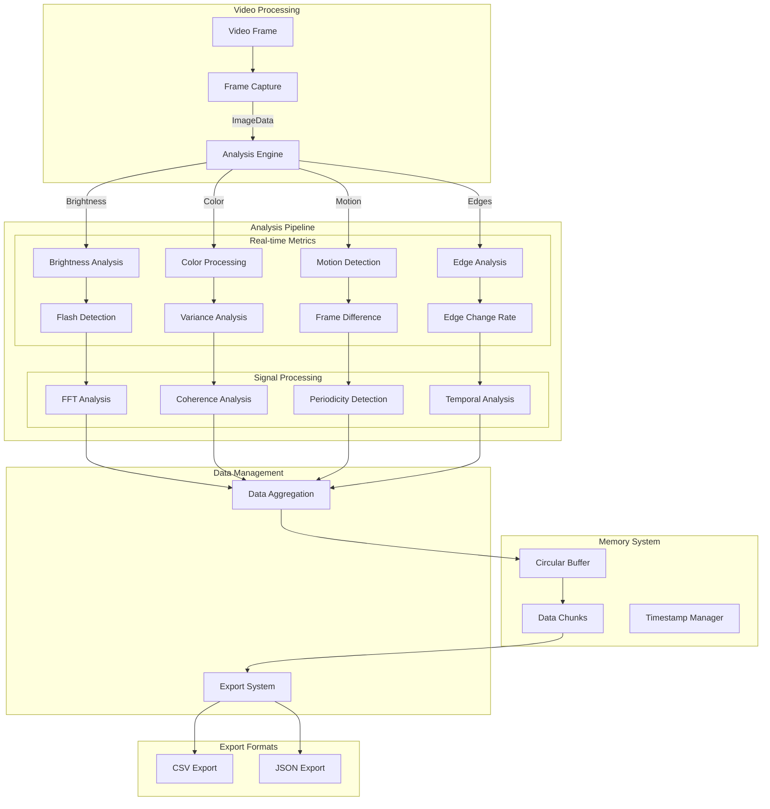

# EPI-LENS
**E**pilepsy **P**hotic **I**ntensity **L**evel **E**valuator for **N**euro Visual **S**timuli

EPI-LENS is a browser extension designed to analyse video content for potentially harmful photosensitive triggers in real-time. It provides detailed metrics and analytics for researchers and accessibility specialists and exports as CSV and JSON.

## Use Cases

### Machine Learning Data Collection
- Generation of training datasets for ML models focused on:
  - Flash detection algorithms
  - Content safety classification
  - Automated video content moderation
- Structured data export in CSV/JSON formats for direct ML pipeline integration
- Frame-by-frame analysis with detailed metrics for model training
- Temporal analysis data for sequence-based learning models

### Accessibility Research
- Quantitative analysis of video content for accessibility studies
- Documentation of potentially harmful content patterns
- Development of improved safety guidelines
- Validation of content modification techniques
- Support for academic research in photosensitive epilepsy triggers
- Identification of problematic sequences
- Guidance for content modifications
- Quality assurance for accessibility compliance

## Architecture 

### Graphs from test run on music performance video 

